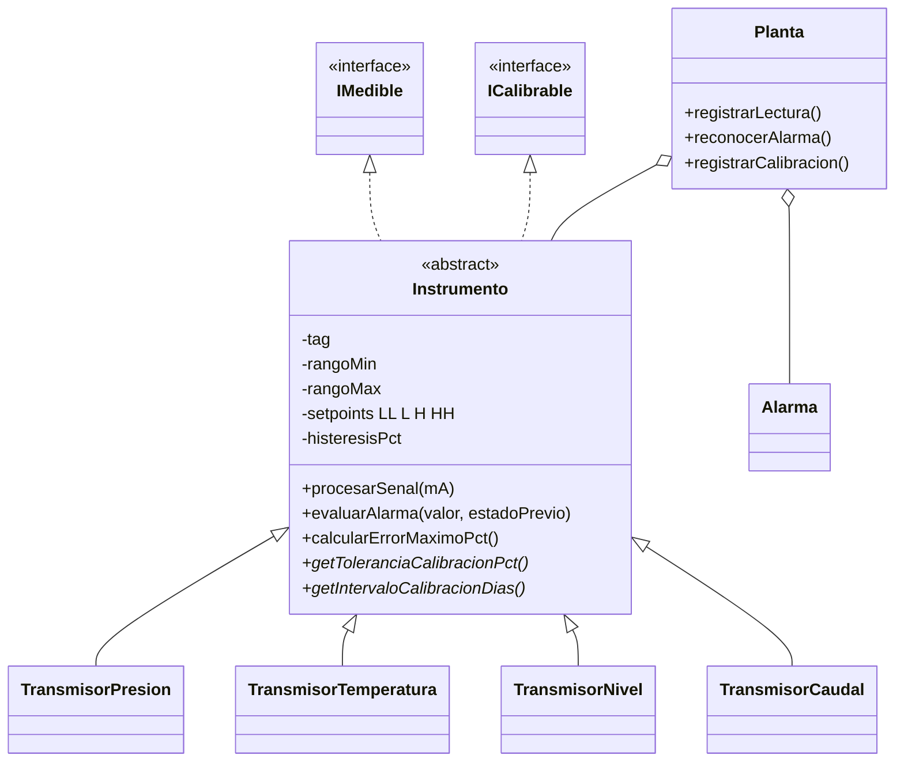

# Monitoreo de Instrumentación Industrial (mini-SCADA en Java)

Aplicación de consola en **Java 17+** que simula el monitoreo de una planta de proceso: transmisores de **presión, temperatura, nivel y caudal** con señal **4-20 mA**, conversión a unidades de ingeniería, **alarmas LL/L/H/HH con histéresis**, detección de **falla de lazo**, reconocimiento de alarmas y control de **calibraciones**.

Nació de unir dos mundos: la **instrumentación industrial** y la **programación orientada a objetos**. Las reglas del sistema (tags, rangos, alarmas, tolerancias de calibración) salen de cómo se trabaja en una planta real.

## Conceptos de instrumentación que implementa

| Concepto | Cómo se refleja en el código |
|---|---|
| **Lazo 4-20 mA** | `Conversiones.mAAValor()` y `valorAmA()` pasan entre la señal y el valor de proceso según el rango calibrado del transmisor |
| **Diagnóstico de lazo (criterio tipo NAMUR NE43)** | Menos de 3.6 mA o más de 21 mA → `FallaDeLazoException` y alarma de falla; entre 3.6–3.8 mA y 20.5–21 mA la lectura se acepta con calidad `FUERA_DE_RANGO` |
| **Nomenclatura de tags (ISA 5.1)** | Los tags deben respetar el formato `XX-123` y el prefijo del tipo: `PT` presión, `TT` temperatura, `LT` nivel, `FT` caudal. Si no coincide, se rechaza el registro |
| **Alarmas LL / L / H / HH** | `Instrumento.evaluarAlarma()`; LL y HH se consideran críticas |
| **Histéresis (deadband)** | Una alarma activa solo se despeja cuando el valor se aleja del setpoint por un margen. Evita decenas de alarmas si la señal oscila justo en el límite |
| **Reconocimiento de alarmas (inspirado en ISA 18.2)** | Cada alarma registra quién la reconoció y cuándo; el ciclo es *activa → reconocida → vuelve a normal* |
| **Calibración con tolerancia** | Se ingresan 5 puntos (0-25-50-75-100 %), se calcula el error máximo en % del span y se compara con la tolerancia del tipo de instrumento. Si es mayor, el equipo pasa a `EN_MANTENIMIENTO` y deja de aceptar lecturas |
| **Vencimiento de calibración** | Intervalo distinto por tipo (365 o 180 días); reportes de vencidas y próximas a vencer |
| **Pt100 (IEC 60751)** | Conversión resistencia ↔ temperatura con ecuación de Callendar-Van Dusen, incluida la rama bajo 0 °C |

Los valores de tolerancia e intervalos de calibración son típicos y están pensados como ejemplo; en una planta real los define el procedimiento de cada sitio.

## Conceptos de programación que aplica

| Concepto | Dónde se ve |
|---|---|
| **Herencia y clases abstractas** | `Instrumento` → `TransmisorPresion`, `TransmisorTemperatura`, `TransmisorNivel`, `TransmisorCaudal` |
| **Polimorfismo** | Cada tipo define su propia tolerancia, intervalo de calibración y principio de medición |
| **Interfaces** | `IMedible`, `ICalibrable` e `IRepositorio<T>` |
| **Genéricos** | `RepositorioArchivo<T>`: una sola clase que persiste cualquier entidad |
| **Excepciones propias** | `FallaDeLazoException`, `OperacionInvalidaException`, `EntidadNoEncontradaException`, `EntidadDuplicadaException` |
| **Streams y lambdas** | Reportes con `groupingBy`, `counting`, `summaryStatistics`, ordenamientos compuestos |
| **Records** | `Lectura` y `RegistroCalibracion` (inmutables) |
| **Enums con comportamiento** | `TipoMedicion` (prefijo ISA y unidad), `EstadoAlarma` (prioridad y etiqueta) |
| **Inyección del reloj (`Clock`)** | `Planta` recibe un `Clock`, así las pruebas usan una fecha fija y los vencimientos son verificables |
| **Serialización** | Instrumentos, alarmas y calibraciones se guardan en `datos/*.dat` y se recuperan al reiniciar |
| **Separación en capas** | `Planta` (lógica) no imprime ni lee de consola; `Main` (interfaz) sí |
| **Simulación determinista** | `SimuladorProceso` usa una semilla: misma semilla, misma secuencia (clave para poder testearlo) |
| **Pruebas** | `PruebasPlanta`: 67 verificaciones sin librerías externas |

## Estructura

```
src/
├── app/          Main.java                   → menú de consola
├── servicio/     Planta.java                 → lógica de negocio y reportes
│                 SimuladorProceso.java       → genera señales 4-20 mA verosímiles
├── modelo/       Instrumento (abstracta)
│                 TransmisorPresion / Temperatura / Nivel / Caudal
│                 Alarma, Lectura, RegistroCalibracion
│                 TipoMedicion, EstadoAlarma, EstadoServicio, CalidadSenal
├── interfaces/   IMedible, ICalibrable, IRepositorio<T>
├── repositorio/  RepositorioArchivo<T>       → persistencia genérica
├── excepciones/  4 excepciones propias
└── util/         Conversiones.java           → mA, Pt100, unidades
test/
└── PruebasPlanta.java
```

## Diagrama de clases (simplificado)



## Ejemplo de salida (tablero)

```
TAG      DESCRIPCION                    VALOR          ALARMA    CALIBRACION    SERVICIO
--------------------------------------------------------------------------------------------------
FT-401   Caudal de gas a quemador       249.28 m3/h    NORMAL    OK (120d)      EN_SERVICIO
LT-301   Nivel tanque TK-301            52.77 %        NORMAL    OK (25d)       EN_SERVICIO
PT-101   Presion descarga bomba P-101   11.57 bar      NORMAL    OK (265d)      EN_SERVICIO
PT-102   Presion separador V-100        18.83 bar      NORMAL    OK (335d)      EN_SERVICIO
TT-201   Temperatura salida horno H-200 195.98 C       NORMAL    VENCIDA (20d)  EN_SERVICIO
```

## Cómo ejecutarlo

Requisito: **JDK 17 o superior** (`javac -version` para comprobarlo).

Desde la raíz del proyecto:

```bash
# 1. Compilar
mkdir bin
javac -d bin -sourcepath src src/app/Main.java

# 2. Ejecutar
java -cp bin app.Main
```

Primer uso: ingresá tu nombre de operador, elegí la opción **13** (cargar planta de ejemplo) y probá:

1. **Opción 3**: simular 100 ciclos de proceso y ver cómo se disparan alarmas y fallas de lazo.
2. **Opción 4 y 5**: ver las alarmas activas y reconocerlas.
3. **Opción 2** con `2` mA en `PT-101`: provocar una falla de lazo a mano.
4. **Opción 9**: registrar una calibración con error chico (aprobada) y otra con error grande (rechazada).
5. **Opción 12**: calculadoras de mA, Pt100 y unidades.

### Correr las pruebas

```bash
javac -d bin -sourcepath src test/PruebasPlanta.java
java -ea -cp bin PruebasPlanta
```

## Limitaciones conocidas

- Las señales son simuladas: no hay comunicación con equipos reales.
- El historial de lecturas vive en memoria (máx. 500 por instrumento); solo se persisten instrumentos, alarmas y calibraciones.
- Una alarma de mayor o menor severidad reemplaza a la anterior del mismo instrumento, en lugar de convivir con ella como en un sistema de alarmas completo.
- No hay autenticación de usuarios: el nombre del operador se ingresa al iniciar.

## Posibles mejoras

- Leer señales reales por Modbus TCP u OPC UA.
- Reemplazar la serialización por una base de datos (SQLite / JDBC).
- Migrar las pruebas a JUnit 5 y agregar Maven o Gradle.
- Tendencias gráficas y exportación de reportes de calibración a PDF o CSV.
- Lazos de control (PID simple) y válvulas de control.
- Interfaz web con Spring Boot.

## Autor

**Angel Venditti** · [GitHub](https://github.com/angelvenditti15-tech)· [LinkedIn](www.linkedin.com/in/vendittiangel)

